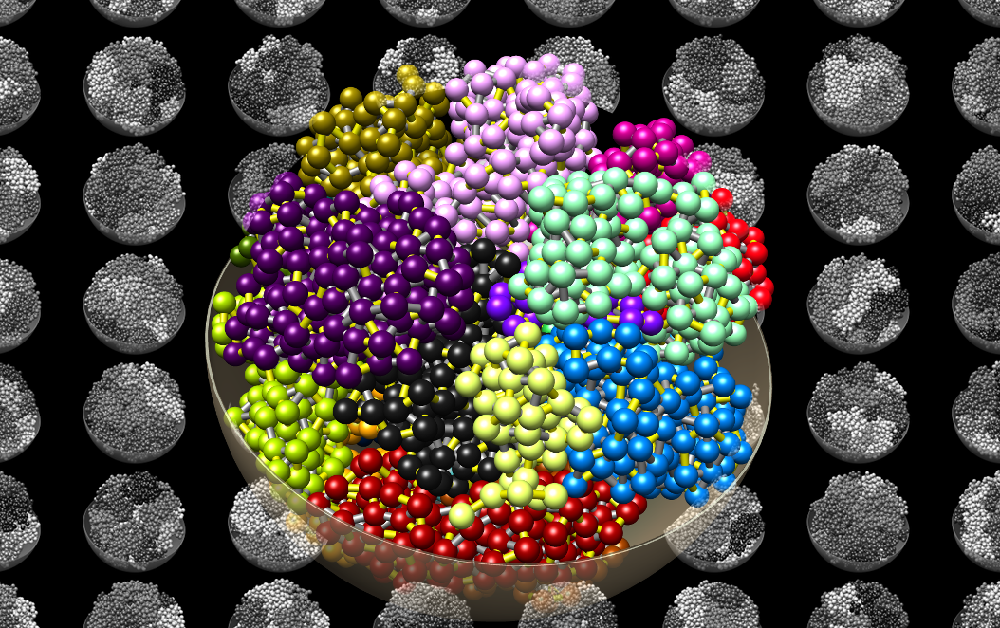

# CHROMFLOCK




## Usage:
Compile, if gcc, pkg-config and zlib are installed, compilation is as simple as:

```
make all
```

To make the binaries and then man pages is visible, use:

```
here=$(pwd)
export PATH=$PATH:$here/bin/
export MANPATH=$MANPATH:$here/man/
```
possibly add that to your `.bashrc` or whatever is used on your system.

To get started, read the man page for `chromflock`, i.e.:

```
man chromflock
```

in general the sequence of command needed to start an experiment are:
```
chromflock
vim chromflock_gen
./chromflock_run
```

If `chromflock_run` was aborted for some reason, inspect `status.txt` to see the last thing that was finished and continue from any line, L, by
```
bash < (sed -n 'L,$p' chromflock_run)
```

# References
For the RNG and Normal distribution:
 -  [A modified ziggurat algorithm for generating exponentially and normally distributed pseudorandom numbers](http://www.tandfonline.com/doi/abs/10.1080/00949655.2015.1060234).


