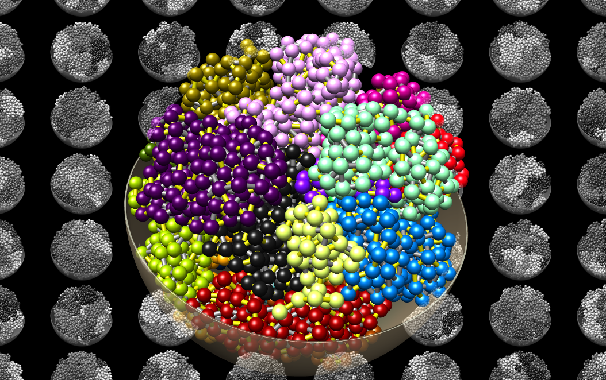

# CHROMFLOCK

## Introduction

**chromflock** is a software package to deconvolve bulk Hi-C data into
putative single-cell structures. The overall scheme is borrowed from
[PGS](https://www.github.com/alberlab/PGS) although it is not a direct
fork.

Chromflock will:
 - Work with haploid as well as diploid structures.
 - Can integrate GPSeq data for radial preferences.
 - Supports spherical as well as an ellipsoidal domain for the beads.

The documentation is not complete at the moment and it is suggested
that anyone interested in chromflock start by reading [Kalhor et al,
2012](https://doi.org/10.1038/nbt.2057), especially the supplementary
materials since much of the terminology used here can be traced back
to that paper.

Installation instructions can be found in [INSTALL.md](INSTALL.md) and
some example usage in [USAGE.md](USAGE.md).

In addition to csv files, chromflock will use chimera marker files
(.cmm) to write out structures for viewing. These can be opened by
[UCFS chimera](https://www.cgl.ucsf.edu/chimera/) and also by
[nua](https://www.github.com/elgw/nua/).

## References

chromflock was used in
 - [Girelli et al. 2020](https://www.nature.com/articles/s41587-020-0519-y).

The ideas behind it can be found in the following papers:
 - [Kalhor et al, 2012](https://doi.org/10.1038/nbt.2057)
 - [Tjong et al, 2016](http://dx.doi.org/10.1073/pnas.1512577113)
 - [Hua et al, 2018](http://dx.doi.org/10.1038/nprot.2018.008) [github](https://www.github.com/alberlab/PGS)

For random numbers chromflock uses
 -  [McFarland, 2014](http://www.tandfonline.com/doi/abs/10.1080/00949655.2015.1060234) [code](https://github.com/cd-mcfarland/fast_prng).
