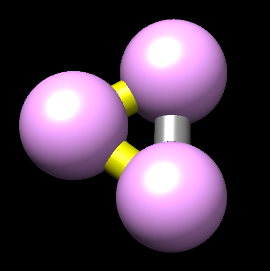
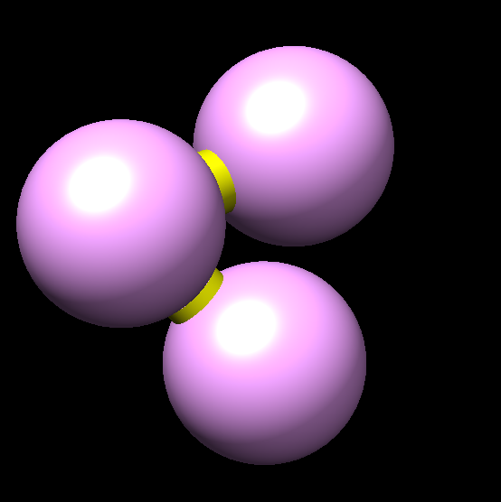
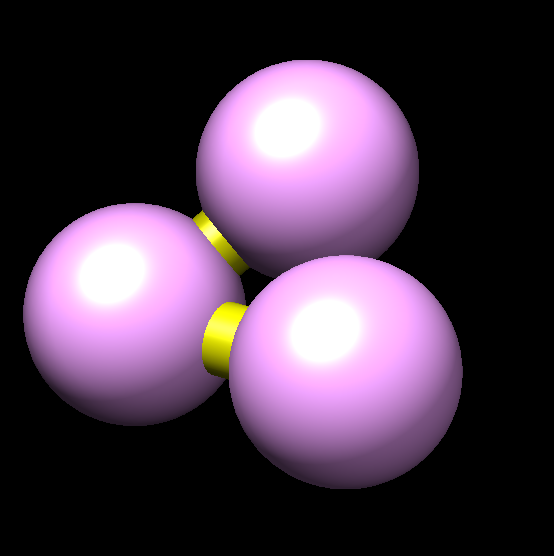

# Usage

If you have installed chromflock there will be man pages for the
binaries, as well a some short usage instructions via the **--help**
flag. The man pages, rendered to text, can also be viewed here:

 - [mflock](man/mflock.txt)
 - [aflock](man/aflock.txt)
 - [chromflock](man/chromflock.txt)

## Prepare input to chromflock
Chromflock requires two data sources:

1. A quadratic and symmetric contact probability matrix which says how
   probable it is that each bead is in contact with every other bead,
   let's assume that you will name it
   **contact_probabilities.double**.

2. An array telling chromflock which bead that belongs to what
   chromosome. Let's assume that you call it **chromosome_labels.u8**.

Both files have to be written as raw data and the user, you, have to
create them.

### Example with two beads
A really small, but correct input pair would be this:

``` math
\mbox{contact\_probabilities} = \begin{bmatrix} 0 & 1 \\ 1 & 0 \end{bmatrix},\quad
\mbox{labels} = \begin{bmatrix} 1 \\ 1 \end{bmatrix}
```

chromflock would interpret it as follows: The first and second bead
are in contact with probability 1, i.e. they will be connected in all
structures. The label matrix will be interpreted as the first and
second bead belong to the same chromosome, 1.

By command line you could create such input by:

``` shell
chromflock string2any contact_pairs.u32 uint32_t 0 1 # note 0-indexed
chromflock string2any chromosome_labels.u8 uint8_t 1 1
```

### Example with three beads
``` math
\mbox{CP} = \begin{bmatrix} 0 & 1 & 0.4\\ 1 & 0 & 1\\ 0.4 & 1 & 0 \end{bmatrix},\quad
\mbox{L} = \begin{bmatrix} 1 \\ 1 \\ 1 \end{bmatrix}
```

If you generate structures with this input, the first and third bead
would be in contact in $`\leq`$ 40% of the structures. I.e., if you
generate 3 structures the contact between the first and the third bead
will be in contact in one of them. I.e., visualized with chimera, this
is what you might get:



where connections between adjacent beads are shown in yellow, other
connections in grey (e.g., the connection between the first and third
bead in this example).

### From Hi-C data
For real data you would start with Hi-C data, load it into
Python/MATLAB or your language of preference and then convert the Hi-C
counts to contact probabilities. Chromflock has a tool to convert raw
counts to contact probabilities (note there are many alternative ways
to do that) which has a command line interface like this:

``` shell
chromflock hic2cpm --help # check this out first
chromflock hic2cpm --hFile HiC-data.double --lFile chromosome_labels.u8 --nStruct 1000
```

Note that you would still have to export the Hi-C data as raw doubles
and write to disk.

## Example usage
Here is how you use the input data that you have prepared to generate
structures:

1. Create a folder
  ``` shell
  mkdir chromflock_test1
  cd chromflock_test1
  ```
  and copy the contact probability matrix and the label array to it.

2. Initialize chromflock
  ``` shell
  chromflock init
  ```
  This will create two new files in the folder:
  - **chromflock_gen** is a shell script and contains the overall
    settings like how many structures to generate, what input files to
    use etc.
  - **mflock.lua** is a lua script and contains the settings for the
    molecular dynamics, i.e. for mflock. This includes the number of
    iterations, the temperature as a function of iterations, the
    strength of the forces etc.

  Edit these files, at least chromflock_gen to set the number of
  structures and the contact probability matrix and the label array
  correct.

  ``` shell
  # Edit settings with vim (or nano or emacs or gedit ...)
  vim chromflock_gen
  # Possibly also the dynamics settings
  vim mflock.lua
  ```
3. Run chromflock
  ```
  ./chromflock_run # runs chromflock
  ```

## Questions and Answers

### Resume aborted work?
If `chromflock_run` was aborted for some reason, inspect `status.txt`
to see the last thing that was finished and continue from any line, L,
by

``` shell
bash < (sed -n 'L,$p' chromflock_run)
```

### What are the columns of `coords.csv`
The columns are `x`, `y`, `z`, `radius`, and
(if supplied) `preferred_radius`.


### Visualizing the results?
Each folder will have a `cmmdump.cmm.gz` which, once extracted, can be
opened with [UCFS chimera](https://www.cgl.ucsf.edu/chimera/) or A per
chromosome color map, which can be found in `src/cmmdump.c` is used.
