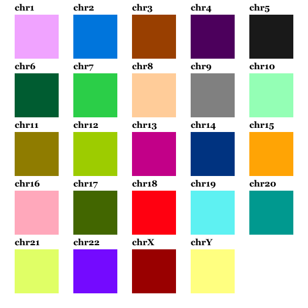

Additional topics
=================

Binning
-------

Most likely it would be better to bin the Hi-C data according to TAD
boundaries than to use regular binning. TADs are compact by definition
which makes it ideal to group together chromatin based on them. By
having bins placed regularly and with the same size, many of them will
cross more than one TAD. Hence regular binning might average out
important differences that would be found if the simulations were based
on TADs.

While you can use non-regular binning, chromflock can at the moment
only use beads of the same size.

The contact probability matrix
------------------------------

The input to chromflock is the contact probability matrix which, for
each pair of beads states the probability that we find those beads in
contact in any of the structures. If we would know how often each bead
is in contact with every other bead in nuclei we could use that data
right away.

Unfortunately neither Hi-C or TCC provides absolute measurements since
they are affected by several biases.

First of all the concept of *contact* is not well defined. It is known
that Hi-C has a certain capture range which is small, but not
neglectable. Most likely it is small enought that we don’t need to care
about it here.

A few factors will also contribute to the efficiency of each genomic
site, i.e., how easy it can be ligated.

Matrix balancing of the Hi-C matrix (that can be done with the
KR-algorithm) is often used as a pre-processing step when
*normalizing* or *correcting* contact data. It should be noted that
using such method, properties like chromatine density will also be
normalized away.

Ellipsoidal domain
------------------

It is possible to use an ellipsoidal domain. Here follows some notes on
how it is implemented and how it differs to a spherical domain.

#. *Slower collision detection*

   At the moment, there is no special handling for ellipses when
   detecting collisions. The same binning structure as we use for
   spheres is used to detect neighbours in ellipsoids. As a consequence
   a few bins will always be empty so the remaining bins have to host
   more beads.

#. The force keeping the beads inside the domain, :math:`F_s`, is
   different. And slower.

   The direction and magnitude of the force that keeps the beads inside
   the domain is found by identifying the closest point on the ellipse
   from each bead. This involves solving a high order polynomial since
   there can be multiple solutions. The force is zero for any bead that
   is completely inside the domain so we can expect that there is a
   unique solution to the problem. This is solved with a few iterations
   of Newtons method, see below.

#. Several distinct ways to incorporate per-bead radial information.

   If there is radial information available, it can be interpreted in
   different ways. The major options are: 1) As geodesic distance to the
   domain boundary (normalized by the largest distance). 2) The length
   to the domain boundary when travelling along the ray that goes
   through the centre of the domain and the bead (normalized by this
   distance). Both alternatives will be equivalent to the definition
   that we use for spheres when the all axes of the ellipsoid are equal.

Distance from point to Ellipsoid
~~~~~~~~~~~~~~~~~~~~~~~~~~~~~~~~

To find the shortest path from a point to an ellipsoid involve finding
the roots of a 6th degree polynomial, see [1]_ and [2]_.

We define an ellipsoid, :math:`E` by the length of it’s axes, :math:`a`,
:math:`b`, and :math:`c` as the set of points :math:`{(x,y,z)}` for
which:

.. math:: f(x,y, z) = \frac{x^2}{a^2} +\frac{y^2}{b^2} +  \frac{z^2}{c^2} - 1 = 0

In matrix form we could write is as :math:`x^TAx = 1` where

.. math::

   A =
     \begin{pmatrix}
       1/a^2 & 0 & 0 \\
       0 & 1/b^2 & 0 \\
       0 & 0 & 1/c^2 \\
     \end{pmatrix}

To find the closest point :math:`x\in E` to a arbitrary point :math:`P`
could be formulated as:

.. math:: x = P_E(y) = \mathop{\mathrm{arg\,min}}_{x^TAx=1} ||y-x||^2

Using Lagrange multipliers, we find the equation:

.. math:: L = ||y-x||^2 + \lambda (1-x^TAx)

The optimality condition states that

.. math::

   \frac{\partial}{\partial x} L = 2(y-x) - 2\lambda Ax = 0\quad
     \mbox{i.e.,}\quad x(\lambda A +I) = y

which gives

.. math::
   :name: eq:1

   x=(\lambda A +I)^{-1}y

We insert that into :math:`x^TAx=1` and get

.. math::
   :name: eq:2

   \left(((\lambda A-I)^{-1})y\right)^TA(\lambda A -I)^{-1}y - 1 = 0

Eq. :ref:`2 <eq:2>` can the be solved numerically
(for :math:`\lambda`) using Newtons method, note that is isn’t
complicated since :math:`A` is diagonal. Finally :math:`x` is obtained
from Eq. :ref:`1 <eq:1>`.

There are other ways to find the closest point, below follows another
approach. For a point :math:`P = (x_P,y_P,z_P)` on :math:`E` the surface
normal is:

.. math:: N_E(P) = 2\left(\frac{x_P}{a^2} + \frac{y_P}{b^2} + \frac{z_P}{c^2}\right)

It can be shown that the closest point :math:`P \in E` from another
point :math:`Q`, :math:`P-Q` is parallel to :math:`N_E(P)`.

Hence, at the solution:

.. math:: N_E(P) = c (P-Q)

With the help of some extra notation: :math:`A=1/a^2`, :math:`B=1/b^2`
:math:`C=1/c^2` we see that:

.. math::
   :name: eq:3

   c = \frac{x_P - x_Q}{x_P A} = \frac{y_P - y_Q}{y_P B} = \frac{z_P - z_Q}{z_P C}

If we extract two equations from Eq. :ref:`3 <eq:3>` and add
the condition that :math:`P` is on :math:`E` we get the following set of
equations:

.. math::

   \begin{aligned}
     c_1(P) = (x_P - x_Q)y_P B - (y_P - y_Q)x_PA \\
     c_2(P) = (x_P-x_Q)z_PC - (z_P-z_Q)x_PA \\
     c_3(P) = A(x_P)^2 + B(y_P)^2 + C(z_P)^2 - 1 \\
   \end{aligned}

which we can compose into a vectorial function which is quadratic in
:math:`P`.

.. math:: C(P) = (c_1(P), c_2(P), c_3(P))

We can find zeros to :math:`C(P)` using the Newton-Raphson method. In
general:

.. math:: X^{(n+1)} = X^{(n)} + J^{-1}(X^{(n)})f(X^{(n)})

where superscript in parenthesis denotes sucessive updated numbers and
:math:`J` is the Jacobian matrix, i.e.,

.. math:: J_{ij}= \frac{\partial f_i}{\partial x_j}

Scaling projection
~~~~~~~~~~~~~~~~~~

Any point :math:`Q\neq 0` can be scaled onto and ellipse. Let

.. math::

   s(Q) = \left(\frac{Q_x}{a}\right)^2 +\left(\frac{Q_y}{b}\right)^2 +
     \left(\frac{Q_z}{z}\right)^2

Then :math:`S(Q) = Q/\sqrt{s(Q)}` is on :math:`E` since
:math:`S(cQ)=S(Q)c^2` and hence

.. math:: s(Q/\sqrt{s(Q)}) = \frac{s(Q)}{s(Q)} = 1

For a more general setting where the ellipsoid is described by a matrix,
:math:`A`, we can introduce the quadratic form
:math:`\langle a, b \rangle
= a^TAb` and the norm :math:`||a|| = \sqrt{\langle a, a \rangle }` then
it is clear that :math:`||\frac{a}{||a||}|| = \frac{||a||}{||a||}`.

This projection the same as scaling along a line that passes the origo.
We define a scaling distance as:

.. math:: d_{S(E)}(Q) = ||Q-S(Q)||

Please note that :math:`d_{S(E)}(Q)` isn’t the shortest Euclidean
distance to the ellipsoid unless :math:`a=b=c`.

Using this we introduce a notation for the shortest distance:

.. math::

   d_{G(E)}(y) =
     \begin{cases}
       \phantom{-}||y - P_E(y)|| & \text{if } d_{S(E)}(x) \geq 1\\
       -||y - P_E(y)|| & \text{if } d_{S(E)}(x) < 1 \\
     \end{cases}

Domain Error / Partial derivatives
~~~~~~~~~~~~~~~~~~~~~~~~~~~~~~~~~~

For a point :math:`p` we first find :math:`r = d_G(p)`. If
:math:`r+R_0 > 0`, the error :math:`E_d(p) = (r - R_0)^2`, otherwise
:math:`0` (compare Eq. `[eq:domError] <#eq:domError>`__ for the
spherical domain) and the gradient is

.. math:: \frac{\partial}{\partial x_i}E_d = \frac{2(p_i-q_i) r}{r-R_0}

Quick discards
~~~~~~~~~~~~~~

If the domain is defined by an ellipsoid, :math:`E=(a, b, c)` then
(lemma) for any point
:math:`Q \in E_\delta=(a-\delta, b-\delta, c-\delta)` the geodesic
distance to :math:`E` is at least :math:`\delta`, i.e.,
:math:`d_{G(E)}(Q)\geq
\delta` (equality along the axes). Equivalently:

.. math:: || p - q || \geq \delta, \quad p\in E, \quad q \in E_\delta

Numerical evaluation
~~~~~~~~~~~~~~~~~~~~

In this section we will study the geodesic shortest distance vs the
distance obtained by scaling for relevant :math:`E` and distances from
:math:`E`, as well as the direction of the normal of :math:`E` at
:math:`P(Q)` vs :math:`S(Q)`.

How can it be tested? What has been tested?

::

   Method        maxerr      relerr    angerr     t         tpp
   scaling1      1.3368e-01  83.55574  1.3161+01  1.17e-01  8.50e+07
   scaling2      3.6489e-01  2.28e+02  3.0681+01  1.87e-01  5.34e+07
   bektas-1      1.3480e-02  8.425478  1.5497+00  2.85e-01  3.49e+07
   bektas-2      1.4290e-04  0.089318  1.4435-02  4.27e-01  2.34e+07
   bektas-3      1.4824e-08  0.000009  3.4150-06  5.70e-01  1.75e+07
   bektas-4      3.3577e-12  0.000000  3.8181-06  7.01e-01  1.42e+07
   bektas-5      3.3577e-12  0.000000  3.8181-06  7.02e-01  1.42e+07
   bektas-99     3.3577e-12  0.000000  3.8181-06  7.02e-01  1.42e+07
   lagrange1     1.1443e-01  71.52170  6.6816+00  3.11e-01  3.21e+07
   lagrange2     1.6737e-02  10.46074  9.4292-01  4.78e-01  2.09e+07
   lagrange3     4.4791e-04  0.279945  2.3522-02  6.46e-01  1.54e+07
   lagrange4     3.3536e-07  0.000210  1.6817-05  8.13e-01  1.22e+07
   lagrange5     2.3831e-13  0.000000  3.8181-06  9.83e-01  1.01e+07
   lagrange99    2.3831e-13  0.000000  3.8181-06  9.83e-01  1.01e+07
   polynomial1   9.0911e-02  56.81946  7.1800+00  1.38e-01  7.21e+07
   polynomial2   4.0359e-02  25.22448  2.8665+00  2.81e-01  3.55e+07
   polynomial3   1.1012e-02  6.883039  6.4450-01  4.71e-01  2.12e+07
   polynomial4   1.0581e-03  0.661334  4.6778-02  6.59e-01  1.51e+07
   polynomial5   1.0840e-05  0.006775  3.4573-04  9.01e-01  1.10e+07
   polynomial99  3.5340e-12  0.000000  3.8181-06  9.21e-01  1.08e+07

Visualizing structure
---------------------

The cmm files generated by mflock can be directly opened in `UCSF
Chimera <https://www.cgl.ucsf.edu/chimera/>`_, most likely also in
their later software `ChimeraX <https://www.cgl.ucsf.edu/chimerax/>`_.

The color map that is encoded in chromflock is for haploid structures only:

References
----------

.. [1] Hart, J.C. (1994). Distance to an Ellipsoid. Graphics gems. `doi <https://doi.org/10.1016/b978-0-12-336156-1.50019-7>`_

.. [2] Alexei Yu. Uteshev, Marina V. Yashina, (2015) Metric problems for quadrics in multidimensional space, Journal of Symbolic Computation, Volume 68, Part 1, `doi <https://doi.org/10.1016/j.jsc.2014.09.021>`_
